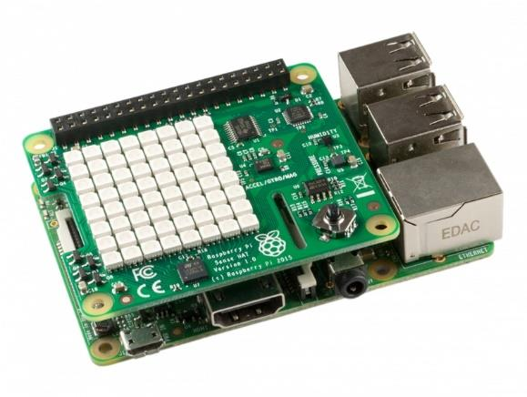

# Sense Snake

Sense Snake is a snake game for the Sense Hat.
The Sense HAT is an add-on board for Raspberry Pi, made especially for the Astro Pi mission.

## Technologies used

- Only pure Python 3

## How to run it
1. Connect the Sense Hat to the Raspberry Pi.
2. Put the code on the Raspberry Pi.
3. Go to the project folder.
4. Run `python Main.py`

## How it works
I've made a custom game engine for the Sense Hat. It's composed of a game screen that is the game orchestrator, a game renderer (to render the game), a game world (to manage the game objects) and an input handler (for gamepad).

## Contribution
Fell free to contribute to this project.